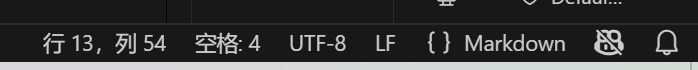

# VScode配置hexo笔记（一）：配置与预备知识
    教程网址：https://xiamu-ssr.github.io/Hexo/categories/Hexo/?t=1739015009016
    学习markdown语法链接：留坑
    配置图片，音视频方法：留坑。（1）图片CTRLv粘贴即可。
    拷贝csdn博文体验：留坑，待做超链接
### 本次踩坑
（1）教程里的hexo init 不要带blog后缀，因为到时候设置工作流时会要求.github目录在根目录。
（2）文末讲的插件并不能起到打开侧边栏功能，需要下载Markdown Preview Enhanced插件，
，注意这里要把文件类型改为markdown，不然快捷键不起作用。ctrl+k v调出预览侧边栏。
  还能通过CTRLshift P键入Markdown Preview Enhanced: Open Preview to the Side打开预览。
