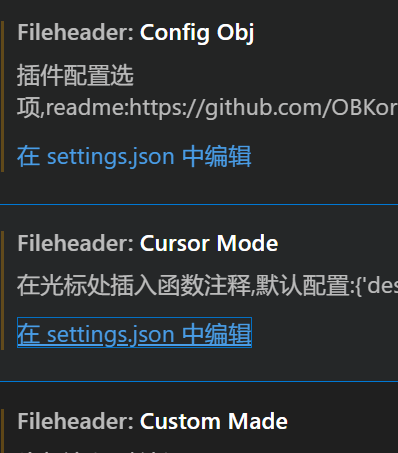

## 注释模板
1. vscode作为文本编辑器极其强大，因此采用配置vscode插件的方法。如果无法使用vscode也可手动复制模板过去。
2. 参考文章：<https://github.com/OBKoro1/koro1FileHeader/wiki/%E5%AE%89%E8%A3%85%E5%92%8C%E5%BF%AB%E9%80%9F%E4%B8%8A%E6%89%8B>  
   <https://github.com/OBKoro1/koro1FileHeader/wiki/%E9%85%8D%E7%BD%AE>
3. koroFileHeader安装，ctrl shift+p打vscode开命令行,输入Open Settings，搜索fileheader。
    

把这个图片里的json都点一下。按理说会弹出来具体的配置，如果没有那自己上网查吧。  
```
//这里给出我的设置
// 头部注释
"fileheader.customMade": {
    // Author字段是文件的创建者 可以在specialOptions中更改特殊属性
    // 公司项目和个人项目可以配置不同的用户名与邮箱 搜索: gitconfig includeIf  比如: https://ayase.moe/2021/03/09/customized-git-config/
    // 自动提取当前git config中的: 用户名、邮箱
    "Author": "git config user.name && git config user.email", // 同时获取用户名与邮箱
    // "Author": "git config user.name", // 仅获取用户名
    // "Author": "git config user.email", // 仅获取邮箱
    // "Author": "OBKoro1", // 写死的固定值 不从git config中获取
    "Date": "Do not edit", // 文件创建时间(不变)
    // LastEditors、LastEditTime、FilePath将会自动更新 如果觉得时间更新的太频繁可以使用throttleTime(默认为1分钟)配置更改更新时间。
    "LastEditors": "git config user.name && git config user.email", // 文件最后编辑者 与Author字段一致
    // 由于编辑文件就会变更最后编辑时间，多人协作中合并的时候会导致merge
    // 可以将时间颗粒度改为周、或者月，这样冲突就减少很多。搜索变更时间格式: dateFormat
    "LastEditTime": "Do not edit", // 文件最后编辑时间
    // 输出相对路径，类似: /文件夹名称/src/index.js
    "FilePath": "Do not edit", // 文件在项目中的相对路径 自动更新
    // 插件会自动将光标移动到Description选项中 方便输入 Description字段可以在specialOptions更改
    "Description": "", // 介绍文件的作用、文件的入参、出参。
    // custom_string_obkoro1~custom_string_obkoro100都可以输出自定义信息
    // 可以设置多条自定义信息 设置个性签名、留下QQ、微信联系方式、输入空行等
    "custom_string_obkoro1": "", 
    // 版权声明 保留文件所有权利 自动替换年份 获取git配置的用户名和邮箱
    // 版权声明获取git配置, 与Author字段一致: ${git_name} ${git_email} ${git_name_email}
    "custom_string_obkoro1_copyright": "Copyright (c) ${now_year} by ${git_name_email}, All Rights Reserved. "
    // "custom_string_obkoro1_copyright": "Copyright (c) ${now_year} by 写死的公司名/用户名, All Rights Reserved. "
},
// 函数注释
"fileheader.cursorMode": {
    
    "description": "", // 函数注释生成之后，光标移动到这里
    "param": "", // param 开启函数参数自动提取 需要将光标放在函数行或者函数上方的空白行
    "return": "",
},
"fileheader.configObj": {

    "createFileTime": true,
    "language": {
        "languagetest": {
            "head": "/$$",
            "middle": " $ @",
            "end": " $/",
            "functionSymbol": {
                "head": "/** ",
                "middle": " * @",
                "end": " */"
            },
            "functionParams": "js"
        }
    },
    "autoAdd": true,
    "autoAddLine": 100,
    "autoAlready": true,
    "annotationStr": {
        "head": "/*",
        "middle": " * @",
        "end": " */",
        "use": false
    },
    "headInsertLine": {
        "php": 2,
        "sh": 2
    },
    "beforeAnnotation": {
        "文件后缀": "该文件后缀的头部注释之前添加某些内容"
    },
    "afterAnnotation": {
        "文件后缀": "该文件后缀的头部注释之后添加某些内容"
    },
    "specialOptions": {
        "特殊字段": "自定义比如LastEditTime/LastEditors"
    },
    "switch": {
        "newlineAddAnnotation": true
    },
    "supportAutoLanguage": [],
    "prohibitAutoAdd": [
        "json"
    ],
    "folderBlacklist": [
        "node_modules",
        "文件夹禁止自动添加头部注释"
    ],
    "prohibitItemAutoAdd": [
        "项目的全称, 整个项目禁止自动添加头部注释, 可以使用快捷键添加"
    ],
    "moveCursor": true,
    "dateFormat": "YYYY-MM-DD HH:mm:ss",
    "atSymbol": [
        "@",
        "@"
    ],
    "atSymbolObj": {
        "文件后缀": [
            "头部注释@符号",
            "函数注释@符号"
        ]
    },
    "colon": [
        ": ",
        ": "
    ],
    "colonObj": {
        "文件后缀": [
            "头部注释冒号",
            "函数注释冒号"
        ]
    },
    "filePathColon": "路径分隔符替换",
    "showErrorMessage": false,
    "writeLog": false,
    "wideSame": false,
    "wideNum": 13,
    "functionWideNum": 0,
    "CheckFileChange": false,
    "createHeader": false,
    "useWorker": false,
    "designAddHead": false,
    "headDesignName": "random",
    "headDesign": false,
    "cursorModeInternalAll": {},
    "openFunctionParamsCheck": true,
    "functionParamsShape": [
        "{",
        "}"
    ],
    "functionBlankSpaceAll": {},
    "functionTypeSymbol": "*",
    "typeParamOrder": "type param",
    "customHasHeadEnd": {},
    "throttleTime": 60000,
    "functionParamAddStr": "",
    "NoMatchParams": "no show param"
}
```
4. ctrl win is生成头部注释；ctrl win t生成函数注释,win y移动行方便修改。
## 变量与函数
1. 命名从现在开始同一小写字母吧，user_id，用下划线隔开词意。
2. 一个函数实现一个功能，要会拆解代码，但是重复的代码要消除。提炼成函数
3. 有集中注册集中注销资源的思想，就像类的构造和析构。
4. 代码块不要超过4层，比如四层if，或者混杂1层if里有一层for里有一层while里还有一层for，太费脑了。
5. 一定要在传入参数的函数开头进行合法性检验，哪怕是if（a>0）这种，千万不能你觉得不可能传入负数就不加这个。  其他的还有指针，数组啥的。
6. 对于只在本文件里出现的函数，建议全部都加static，确保安全性，这不会增加花销。static声明函数名在头文件会报错，static声明函数体在头文件不会报错但是太蠢了，每包含一次头文件就占一份资源。
7. 变量只作一个用途(这个目前没啥体会，先mark一下)，少用全局变量，用了全局变量也最好用static修饰一下，但是你就是想要外部访问那没办法。
8. 局部变量和全局变量不要重名，使用变量作为右值时最好在附近初始化且赋值。
9. 初始化顺序以及强制转换数据类型可能导致不可控结果（没啥体会，先mark一下）