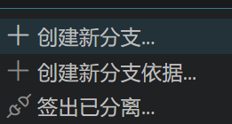

# 使用模板
<https://github.com/othneildrew/Best-README-Template.git>。fork到本地后注意看自己有无改名仓库的需求。

# 养成一个习惯：不要在 main 分支上乱试代码。
1. 在最开始就不应该往main分支写东西，init好工程后第二步就应该是创建分支，每实现好一个子功能合并一次分支。然后再main分支的readme中写你更新了啥。
vscode环境：
1. 点击左下角的主分支名后vscode的搜索栏会弹出；  
。
创建新分支依据是指从某一个旧的存档点或者远程分支开一个新分支。签出已分离是指回放查看过去分支，当你点这个并选择一个旧的提交（Commit）时，你进入了“分离头指针（Detached HEAD）”状态。
2. 新建分支后其他操作不变，在提交时可以选择要提交哪个分支。
3. 如果分支完成了对应的功能就可以切换到main分支执行合并了，同时这里可以体会到不用对main分支进行任何修改操作的重要性。分支的本意是增量更新，你增量的基础main都变了，那还更新个毛线啊全乱套了。 
4. 切换分支前记得push一下，你不push，git可不敢擅自抛弃这些修改。
5. 切换分支中是origin/前缀的代表远端分支，没有的代表本地分支。
6. 合并分支可以ctrl shift P 搜索git merge或者去侧边栏慢慢找，是有的。

git bash指令：
```
# 确保你在主分支
git checkout main
# 创建并同时切换到新分支
git checkout -b feat-my-feature
# 将修改的文件放入暂存区 ( . 代表当前目录下所有改动)
git add .
# 正式保存到本地仓库，并写下备注
git commit -m "feat: add i2c module"
# 第一次推送新分支需要关联远程仓库 (origin)
git push -u origin feat-my-feature
# 1. 切回主分支
git checkout main
# 2. 拉取云端最新代码（防止别人改了你没同步）
git pull origin main
# 3. 把功能分支合进来
git merge feat-my-feature
# 4. 推送到云端 main
git push origin main
# 删除本地分支
git branch -d feat-my-feature
# (可选) 删除 GitHub 云端的远程分支
git push origin --delete feat-my-feature
```