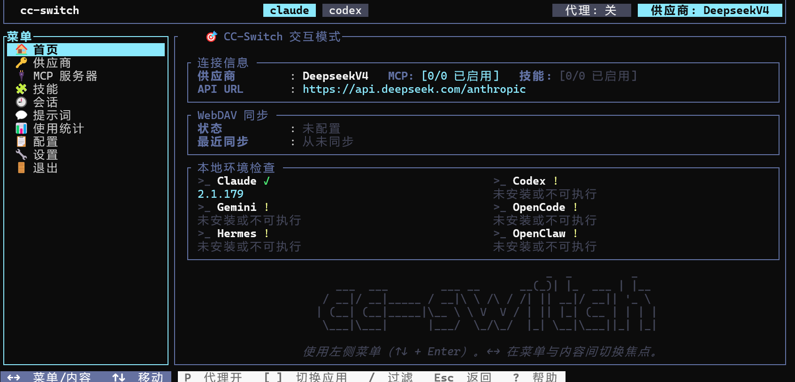
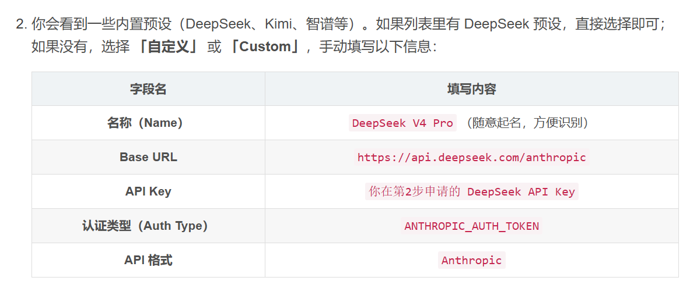
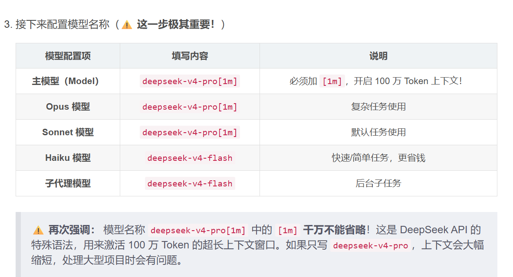

# cc-switch介绍
输入供应商信息他会自动拦截本地Claude改为自己的。一旦配置好供应商就能开始使用极其方便。
## 安装
- 参考博文：<https://jishuzhan.net/article/2044313323597004801>.
只需要参考部分，内容如下：
1. curl -LO https://github.com/saladday/cc-switch-cli/releases/latest/download/cc-switch-cli-linux-x64-musl.tar.gz
2. tar -xzf cc-switch-cli-linux-x64-musl.tar.gz
3. chmod +x cc-switch
4. sudo mv cc-switch /usr/local/bin/
5. cc-switch --version 验证安装是否成功
## 使用
终端输入cc-switch即可调出窗口，如下

## 配置为deepseek
- 参考博文：<https://blog.csdn.net/weixin_53876268/article/details/160692950>
由于是csdn的文章可能会变成vip才能看，所以截取一点关键内容：
1. 选择供应商新增时用custom
2. 
3. 
# Claude终端使用
1. npm install -g @anthropic-ai/claude-code
2. cd 你的项目文件夹路径
```claude```
3. 搞定
# vscode使用
1. 安装插件即可。
