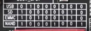

> 因为之前学习过基础知识但是发现重新拿起板子还是一脸懵，所以写一个从零开始的使用教程。
# 环境准备
1. 串口助手MobaXterm安装
2. 下载mtf_tools烧录工具，记得关杀毒软件再烧录。如果你遇到失败的话。
3. qt交叉编译工具安装，正点原子教的是在sh文件里source环境变量，用vscode的话记得是在bashrc加这个。
4. 启动方式介绍

emmc可以理解为内存flash启动，SD卡是外部介质启动。USB为默认烧录模式，烧录软件为 mfgtool 上位机。SD卡还能选择读卡器在自己电脑上烧写。但是反正都是把自己电脑的文件烧写后启动，不如直接在板子上烧写算了。
5. 编译器路径/opt/fsl-imx-x11/
4.1.15-2.1.0/sysroots/x86_64-pokysdk-linux/usr/bin/arm-poky-linux-gnueabi/arm-poky-linux-gnueabi
-gcc(g++),这个不重要。关键是如果在vscode移植，请参考这篇博客：。
6. 移植到板子上运行，可执行文件路径在build/project_name（文件名）。复制过去直接执行即可。对于运行所需要的动态库。需要去编译qt源码和对应操作的屏幕源码然后移植到板子上，由于不重要，可以直接使用别人移植好的linux系统，比如正点原子的出厂镜像就移植好了。
7. 对于怎么移植文件过去，可以sd卡拷过去，可以u盘mnt挂载上去，可以NFS下载过去，可以使用4G模块传输过去，自己选吧。
8. 对于官方的qt进程，好像是叫啥/opt/ui/systemui。你ps -ef，如果太长再搜搜咋筛选吧。杀进程是kill -9 进程号。
9. 彻底禁用：grep -r "systemui" /etc/init.d/，然后去那个脚本里找到/opt/ui/systemui &禁用。（这一条我还没试过不保真）