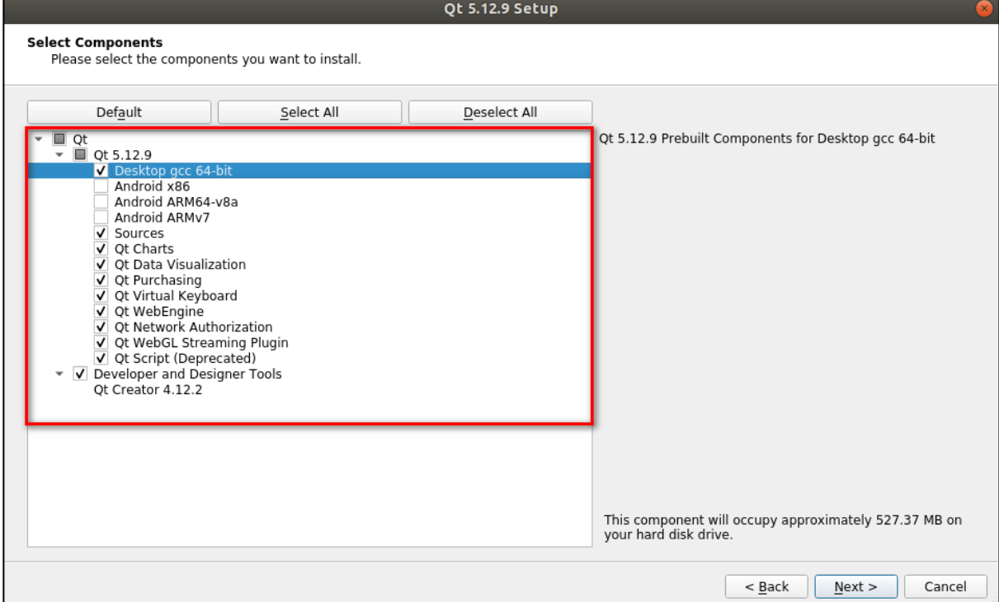

# 安装
1. 在linux端配置好代理后，执行`wget https://download.qt.io/archive/qt/5.12/5.12.9/qt-opensource-linux-x64-5.12.9.run`
2. 大文件下载可能会网络波动导致失败，重新下载指令如下
```
(1)不关代理。wget -c --no-check-certificate https://download.qt.io/archive/qt/5.12/5.12.9/qt-opensource-linux-x64-5.12.9.run
(2)关代理。unset https_proxy
unset http_proxy
# 然后再尝试断点续传
wget -c https://download.qt.io/archive/qt/5.12/5.12.9/qt-opensource-linux-x64-5.12.9.run
```
3. 趁现在去注册qt账号，有账号的回想一下，qt官网为：<https://www.qt.io>
4. 执行命令开始安装，
  ```
  chmod +x qt-opensource-linux-x64-5.12.9.run
  sudo ./qt-opensource-linux-x64-5.12.9.run
  ```
5. 配置如下，
## wsl问题
如果你是win10，默认没有图形化界面的。
1. 下载VcXsrv <https://sourceforge.net/projects/vcxsrv/files/latest/download。>
2. 在桌面找到安装好的图标后启动，选择 Multiple windows，Display number 输入 0。然后选择 Start no client。勾选勾选 "Disable access control"即可。
3. 推荐安装依赖以及环境变量
```
sudo apt update && sudo apt install -y libxcb-xinerama0
下面两句是写入bashrc的
export DISPLAY=$(cat /etc/resolv.conf | grep nameserver | awk '{print $2}'):0
alias qtcreator='/opt/Qt5.12.9/Tools/QtCreator/bin/qtcreator &'

source ~/.bashrc
```
4. 执行qtcreator即可调出窗口。
## 中文
在tool opions Environment interface，这里路径下设置。  
至于输入中文，我懒得折腾了，在windows下复制过去吧。

# 创建工程
> 参考文档为正点原子的qt教程，下载路径为imx6ull下的参考资料。 
>
## 相关名词解析
1. qmake：生成makefile编译的项目
2. 基类选择自行去了解，新手默认即可，嵌入式开发一般用没有状态栏的Qwidget
3. translation file可读的翻译软件极少用到点击下一步即可。
4. 工程目录中头文件和源文件就不多介绍了，form文件夹指的是ui资源，采用xml语言到时候编译的时候会生成对应的代码，不能手动编辑双击跳转到图形化界面编辑。pro后缀的文件是项目管理文件后续有大用。
5. ui设计页面左边是控件选择，中间是效果，右边是类和类的属性显示
## hello world
1. 双击ui软件，找到label控件，拖动，输入文字即可。教程似乎没讲但是ctrl+s似乎有用。
2. 回到编辑页面点击左下角绿色开始按键，开始编译，底部编译输出按键可以看结果。
3. 参考文档说会遇到sudo apt-get install libglu1-mesa-dev问题但是我一次成功了，遇到的是warning: implicitly-declared ‘QVariant::Private&...，这个是警告，意思是qt版本有点老了，可以忽略，有一说一警告标红色干嘛。。。
## 信号与槽
### 简述
1. 信号连接到槽上，当对象发出信号则对应连接的槽就被触发执行。  
2. 要设置这个需要进入signal/slots模式，在ui设计页面的中间上方按键，如果要退出点击左边按键edit widgets即可。
3. 进入信号槽编辑模式后，点击拖到控件，会弹出页面，右边是对象的槽函数，在初始main函数中只有QMainWindow的槽函数，左边是该控件的信号，选择匹配即可，比如按键的click()信号匹配close槽。这里的信号和槽他们都是基础父类得来的因此需要在匹配页面把显示基础打开。
4. 编写槽函数，在编辑页面左键转到槽，跳到对应的槽函数，比如close功能就需要this->close();
### 详述
1. 槽函数是自动执行的，目标函数去执行槽，所以之前体验的教程中是编辑mainwindow的函数，信号与槽的绑定函数为：`QObject::connect(sender, SIGNAL(signal()), receiver, SLOT(slot()));`  ,传入参数为：信号发射的对象，信号，接收信号的对象，槽
2. 连接多个槽的执行顺序按连接时的顺序来
3. 信号可以连接信号,`connect(pushButton, SIGNAL(objectNameChanged(QString)),this, SIGNAL(windowTitelChan
ged(QString)));`
4. **在使用信号与槽的类中，必须在类的定义中加入宏 Q_OBJECT**
5. 发射信号如同调用代码，有阻塞效果，执行完毕才到后面的语句。
6. 有断开信号和槽连接的方法，disconnect，一般不咋用吧
#### 取消ui编辑界面的代码编写
1. 创建项目时不生产ui文件即可。
2. 信号无需定义，只需要声明，为了在QMainWindow类添加信号，打开MainWindow的头文件。之前说的那个宏已经默认生成了，没有的自己添加。  因为信号只是起到触发作用真正起作用的函数是槽函数
3. 在类中写入
```
signals:
/* 声明一个信号，只需声明，无需定义
void pushButtonTextChanged();
``` 
这个signals写法是和public同级的，这是引入了moc的工具，他最终是把这个处理成public，这个工具的其他作用还有处理那个 Q_OBJECT宏。
4. 显示mainwindow中会有很多其他的类对象，而信号的声明正式声明这些类对象的函数。因此还需要引入相应对象的头文件。
```
/* 引入 QPushButton */
#include <QPushButton>
```
5. 信号函数和槽函数的参数和返回值要一样，从抽象概念理解上信号发射和接收方当然要一样，  
从代码理解来讲，实际上连接就是把信号发来的参数当参数传给了槽函数，如果不一样会报错。
6. 定义槽函数需要先创建好绑定对象，然后再在目标执行槽函数的主体上创建槽函数。代码为：
```
public slots:
/* 声明一个槽函数 */
void changeButtonText();
/* 声明按钮点击的槽函数 */
void pushButtonClicked();
private:
/* 声明一个对象 pushButton */
QPushButton *pushButton;
```
定义了公有属性的槽函数。
7. 这样可以发现在同一份头文件里又有信号又有槽，笔者在这里有些迷糊了，实际上最开始声明的那个信号是mainwindow的信号，如果只是把槽和类绑定的话不需要声明信号。
8. 个人c++语法拾遗，实例化对象一定是在cpp文件里实例化的，在头文件里只是声明。
9. 接下来实例化对象和实现具体的槽函数即可。打开cpp文件。
```
#include "mainwindow.h
MainWindow::MainWindow(QWidget *parent)
: QMainWindow(parent)
{
/* 设置窗体的宽为 800,高为 480 */
this->resize(800,480);
/* 实例化 pushButton 对象 */
pushButton = new QPushButton(this);
/* 调用 setText()方法设定按钮的文本 */
pushButton->setText("我是一个按钮");
}
MainWindow::~MainWindow()
{
}
/* 实现按钮点击槽函数 */
void MainWindow::pushButtonClicked()
{
/* 使用 emit 发送信号 */
emit pushButtonTextChanged();
}
/* 实现按钮文本改变的槽函数 */
void MainWindow::changeButtonText()
{
/* 在槽函数里改变按钮的文本 */
pushButton->setText("被点击了！ ");
}
```
10.  使用emit 信号函数，主动发送信号，由于目标是操作mainwindow下的对象因此使用槽函数去触发修改按键对象。
11.  连接信号和槽:写在类的构造函数
```
connect(pushButton, SIGNAL(clicked()), this,
SLOT(pushButtonClicked()));
connect(this, SIGNAL(pushButtonTextChanged()), this,
SLOT(changeButtonText()));
```
#### 控件积累
详细参考我之前提到的正点原子文档，这里只做特殊控件的介绍。
